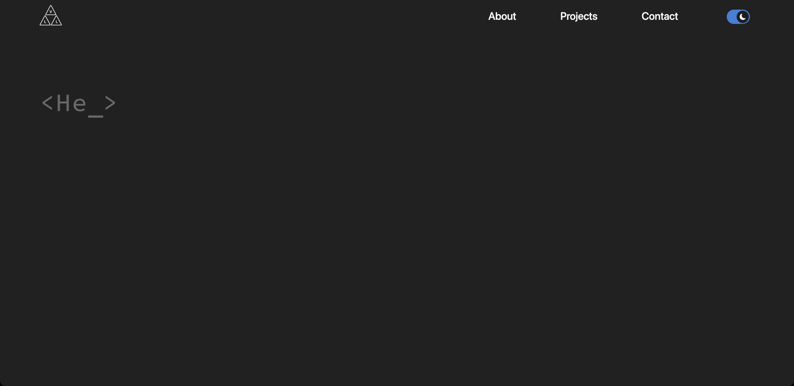

# Portfolio

My very first personal website. A simple and minimalistic portfolio built with [Next.js](https://nextjs.org) and styled with [Sass](https://sass-lang.com/) to showcase my skills and projects as a junior developper. 

## ✨ Features

- Responsive layout
- Dark mode
- Call to the Github API to fetch my latest projects
- Contact form using SendGrid
- CSS animations and transition

## 🧭 Usage

1. Clone this repo and access it with `cd`
2. Install all the modules by using `npm i` or `npm install` or `yarn`
3. Create a .env.local file for API keys (GHTOKEN for GitHub and SENDGRID_API_KEY for SendGrid)
4. Run the local development server by using `npm run dev` or `yarn dev`
